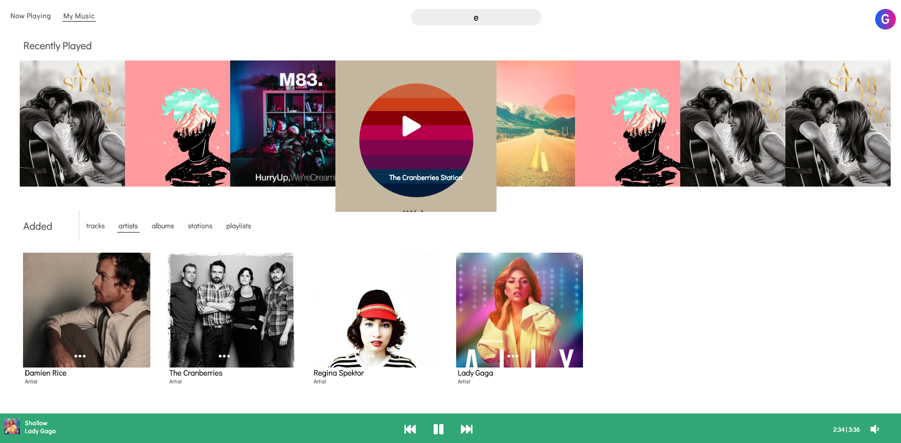

# Pyrrha
 

Pyrrha (PEER-ah), named after the daughter of Pandora, is a clone of the music playing app, Pandora. Pyrrha allows you to search for music, curate your own music collections, and discover new music.

## Demo
[Here](https://pyrrhaa.herokuapp.com/?#/login) is the live working version 

## Built With
* Ruby On Rails (backend)
* React/Redux (frontend)
* PostgreSQL (database)
* Amazon S3
## Features 
Pyrrha allows you to search for music, add songs to personal playlists, create personalized stations based on multiple inputs such as artists, albums, and songs, & curate collections of music as well.

### Recently Played

When you play a station, playlist, or album, Pyrrha will remember and add the station to your featured list of recently played items, which allows for easy retrieval of your favorite stations, playlists, etc., 
```javascript
export const fetchPlaybarPlaylist = id => dispatch => {
    dispatch(loadingTrueRecent());
    dispatch(loadingTrue());
    const recent = { 
        media_type: 'playlist', 
        media_id: id 
    };
    RPApiUtil.postRecentPlay(recent)
    .then(payload => {
        
        dispatch(receiveRecentPlaylists(payload.playlists));
        dispatch(receiveRecentAlbums(payload.albums));
        dispatch(receiveRecentStations(payload.stations));
        dispatch(receiveRecentTracks(payload.tracks));
    });
    PBAPIUtil.fetchPlaylist(id).then(payload => {
        const track = payload.tracks[payload.playlist.trackIds[0]];
        const artist = payload.artists[track.artistId];
        
        dispatch(receivePlaybarSong({track, artist}));
        dispatch(receivePlaybarPlaylist(payload.playlist.trackIds, 
        payload.playlist.title));
    });
};
```
**When a http request is made to the server to fetch a playlist, a post request is also made to record the user's play history.**
### Creating Playlists

Pyrrha makes it easy to add songs to both new and already-created playlists. Users can add songs through both search results as well as while viewing albums and playlists. Dropdown menus make it easy to specify exactly what playlist a user wants to add the song to.
```javascript
postStation() {

        const { title, id } = this.props.track;
        const station_title = title + ' Station';
        this.props.postStation({ title: station_title, mediable_id: id, mediable_type: 'Track' })
            .then(id => this.props.history.push(`/my-music/stations/${id}`));  
    }
    followTrack(){
        const {userId, track} = this.props;
        const info = {userId: userId, type: 'Track', mediaId: track.id}
        this.props.addFollow(info);
    }
    showPlDD() {
        
        this.setState({ displayPlaylistDropDown: true})
    }
    hidePlDD() {
        this.setState({ displayPlaylistDropDown: false })
    }
    addTrackToPlaylist(id){
        const pl = {playlistId: id, trackId: this.props.track.id};
        this.props.addSongToPlaylist(pl)
            .then(id => this.props.history.push(`/my-music/playlists/${id}`))

    }
    createPlaylist(){
        let pl = {title: 'New Playlist', trackId: this.props.track.id}
        this.props.createPlaylist(pl)
        .then(id => this.props.history.push(`/my-music/playlists/${id}`));
    }
```
**Reusable component functions that create & add to playlists, as well as save songs to the User's saved song page**
## Still to Come
* Search for playlists
* Improve algorithm for generating station music
* Artist show page
* Display lyrics and other information on now playing page
